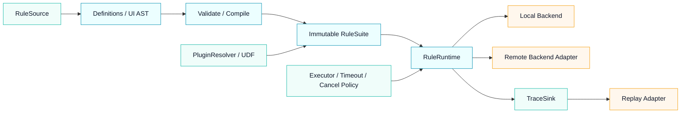

# Mosika 技术演进规划 v1

> 状态：当前规划
> 日期：2026-08-04
> 变更摘要：建立首版独立内核演进路线，覆盖语义契约、运行时隔离、平台中立 SPI、追踪回放、本地/远程执行一致性、模块化与质量基线。

## 1. 定位

Mosika 是从公司级规则产品生态中抽取的独立语义内核。企业内部已经围绕同一内核衍生出可拖拽编辑、在线编译与测试、动态插件热插拔、实时回放、本地执行和远程执行；这些能力证明了内核可以同时支撑多种产品投影，但企业平台实现及其架构适配不进入本仓库。

独立项目长期维护三类稳定资产：

1. `mosika-core`：DSL、`RuleNode`、求值、UDF、`RuleSuite` 与 `RuleFlow`；
2. `mosika-ui`：可序列化的多分类 UI AST，以及到执行树的单向编译；
3. 平台中立契约：让规则来源、插件、执行后端、追踪和回放通过适配层接入内核。

`mosika-web` 是独立运行和交互验证的参考控制面，不复制企业平台的全部基础设施。

## 2. 长期技术目标

- 同一份规则流在编辑、编译、测试、本地执行、远程执行和回放中具有相同语义。
- 内核不依赖业务场景、租户路由、发布平台、存储系统或 RPC 框架。
- 平台扩展通过稳定 SPI 接入，不修改 `RuleNode` 的执行语义。
- 兼容性由可执行测试证明，不依赖文档约定或人工判断。
- 运行时策略可注入、可隔离、可观测，同时保持短生命周期规则求值模型。
- 独立使用者可以只引入所需模块，不被 Web、GraalJS 或企业平台依赖强制绑定。

## 3. 必须保持的语义不变量

以下契约是演进过程的硬边界；如确需改变，必须进入主版本升级并提供迁移说明和兼容性语料。

1. `RuleNode` 及具体节点类型是规则语义的唯一来源。
2. `->` 表示串行，`=>` 表示并行；结构作用域由递归树决定，不从布局或连线推断。
3. `AndNode`、`OrNode`、`HitsNode` 解释匹配状态并按各自规则短路。
4. `SerNode`、`ParNode` 执行全部结构分支；正常完成统一返回 `result=null、matched=true`。
5. `EvalResult.matched` 表示匹配或控制状态，`result` 只传递具有明确语义的业务值。
6. `Flow` 可以通过 `JNode` 嵌入纯 `Rule` 子树，`Rule` 不能反向包含流程节点。
7. UI AST 及其 JSON 是编辑和持久化的事实来源，只允许单向编译为执行树。
8. `RuleFlowDefinition` 是声明态，`RuleFlow` 是编译后的运行态；业务标识到 `flowId` 的路由留在内核外部。
9. 未命中是正常业务状态，执行异常继续通过异常机制传播。
10. JavaScript 表达式面向可信规则作者，完整表达式能力不因平台安全策略而被静默收窄。

## 4. 总体架构方向



核心只定义语义和生命周期；来源、插件装载、传输、存储、权限、审计和调度由适配层实现。

## 5. 演进阶段

### M0：语义与兼容性基线

目标：先把已经验证的行为固化为可执行契约，再进行结构调整。

交付物：

- 建立独立兼容性测试集，覆盖 DSL 优先级、递归组合、UI JSON、`NodeResult`、异常和跨 Flow 调用。
- 引入脱敏的真实结构语料，覆盖宽树、深树、串并行嵌套、决策、`hits` 和插件规则。
- 为 DSL、UI JSON、Java API、插件 SPI 和执行结果分别定义兼容级别。
- 建立 JDK 21 基线，并为后续受支持 JDK 建立构建矩阵。
- 恢复持续维护的编译、执行、并发和大树性能基准，记录环境和基线提交。
- 为公开 API 增加二进制兼容性检查；当前 `1.0.0` 之后的发布使用不冲突的新版本。

验收标准：

- 当前全部测试继续通过，兼容性语料可以在干净环境重复执行。
- DSL、UI JSON 和结果契约的每个不变量至少有一个正向和一个失败用例。
- 性能基线包含编译耗时、单次求值、并行求值、快照刷新、深树和宽树六类指标。
- 后续提交能够自动识别语义变化、公开 API 破坏和显著性能退化。

### M1：运行时隔离与策略注入

目标：让同一进程安全承载多个套件、版本和执行策略，为回放与远程执行建立基础。

交付物：

- 引入显式 `RuleRuntime` 或等价运行时上下文，持有当前执行使用的 `RuleSuite`。
- 将 `RuleSuite.current` 降级为兼容入口；新增代码不再依赖进程级唯一套件。
- `sys.flow.eval` 通过当前执行作用域解析目标 Flow，避免跨套件串用。
- 将并行执行器、最大等待时间、取消和拒绝策略抽象为可注入运行策略。
- 明确上下文复制、共享和写入规则，保持并行分支行为可预测。
- 为候选套件构造、原子发布、旧请求继续使用旧快照补充并发测试。

验收标准：

- 同一 JVM 可同时执行至少两个互相隔离的 `RuleSuite`，跨 Flow 调用不会越界。
- 默认策略保持当前节点语义和异常契约不变。
- 并行超时、中断、取消、拒绝和业务异常均有确定且可复现的结果。
- 快照切换期间不存在半构造套件、配置与运行态不一致或正在执行请求被污染。

### M2：平台中立 SPI

目标：把公司平台已经验证的扩展形态抽象为中立接口，但不把平台实现复制进内核。

候选 SPI：

| SPI | 职责 | 明确不负责 |
| --- | --- | --- |
| `RuleSource` | 提供规则、UDF 和 Flow 定义及版本 | 数据库选型、配置中心协议 |
| `SuitePublisher` | 发布候选套件并管理版本可见性 | 审批流、灰度平台实现 |
| `PluginResolver` | 解析插件描述并提供 UDF/扩展实例 | 企业插件仓库和权限系统 |
| `ExecutionBackend` | 统一承载本地或远程执行入口 | RPC 协议、服务发现、负载均衡 |
| `TraceSink` | 接收独立的结构化执行事件 | 把诊断字段塞入 `EvalResult.result` |
| `ReplayResolver` | 根据执行快照定位定义、插件和运行策略 | 企业存储、数据脱敏和访问控制 |

交付物：

- 定义 SPI 生命周期、线程安全、错误传播和关闭契约。
- 插件装载与卸载不修改已发布套件；新版本通过候选套件重新装配后发布。
- 为类加载器隔离、重复装卸、线程上下文和资源释放建立压力测试。
- 参考 Web 只通过公开 Core/UI API 和 SPI 接入，不使用包内实现细节。

验收标准：

- 至少提供内存规则源、本地执行后端和日志追踪接收器三个参考实现。
- 企业平台适配器可以在不修改 Core 的前提下接入相同 SPI。
- 插件反复装卸后无残留线程、不可回收类加载器或跨版本实例污染。
- SPI 异常不会被误报为规则未命中，也不会破坏当前可用快照。

### M3：追踪、快照与回放

目标：让执行过程可以独立记录、传输和重放，同时保持结果模型职责不变。

交付物：

- 定义独立于 `EvalResult`、`RuleResult` 和 `NodeResult` 的执行事件模型。
- 事件覆盖编译版本、套件版本、Flow、节点路径、插件版本、开始/结束、耗时、结果摘要和异常摘要。
- 定义回放快照：规则定义、Flow 定义、插件清单、运行策略版本和输入引用。
- 节点路径由结构产生，不依赖画布坐标、临时 UI ID 或对象内存地址。
- 支持验证回放和诊断回放：前者比较规范化结果，后者还比较结构事件序列。
- 明确敏感输入、业务结果和异常信息的脱敏扩展点。

验收标准：

- 相同快照和输入在本地重复执行时得到相同的规范化结果与结构事件关系。
- 回放缺少规则、插件或策略版本时明确失败，不静默使用当前版本替代。
- 追踪关闭时不改变执行结果；追踪接收器失败按配置隔离或失败，不污染业务值。
- 回放能力不要求在核心结果对象中新增诊断字段。

### M4：本地与远程执行一致性

目标：把“执行在哪里”降级为后端选择，不改变规则语义。

交付物：

- 定义平台无关的执行请求、响应和错误封装，保持它们与核心领域对象分离。
- 明确 target、context、数值、时间、异常和插件参数的跨进程序列化边界。
- 建立相同套件在本地后端和参考远程后端的契约测试。
- 支持请求携带期望套件版本；远端不存在该版本时拒绝执行，不自动漂移。
- 定义超时、取消、重试和幂等责任：内核负责单次执行语义，平台负责跨请求治理。

验收标准：

- 本地与远程执行的 `matched`、业务 `result`、异常类别和结构事件可规范化比较。
- 套件版本、插件版本或序列化能力不匹配时快速失败并给出明确错误。
- 远程传输不会把网络失败转换成业务未命中。
- 重试不会被内核隐式执行，避免动作规则被未知次数重复调用。

### M5：模块化与依赖治理

目标：降低独立接入成本，让调用方只引入所需能力。

评估并逐步形成以下边界：

```text
mosika-model       AST、定义、结果契约；不依赖 GraalJS 和 Web
mosika-parser      ANTLR DSL 解析和 RuleNode 构造
mosika-runtime     RuleSuite、RuleRuntime、执行上下文和 Java UDF
mosika-runtime-js  GraalJS 表达式与 JavaScript UDF
mosika-ui          UI AST、JSON 类型映射和单向编译
mosika-spi         来源、插件、执行后端、追踪与回放接口
mosika-web         参考控制面与独立运行服务
```

该拆分是目标边界，不要求一次性机械搬迁。只有能够减少传递依赖、明确生命周期或支持独立复用时才拆模块。

交付物：

- 盘点并移除 Core 中未实际使用或只服务特定序列化格式的依赖。
- 将 GraalJS、Protobuf/Kotlin 适配和平台扩展从最小模型依赖中分离。
- 为每个模块定义公开包、内部包和依赖方向。
- 提供最小纯 Java、JavaScript Runtime、UI AST 和参考 Web 四类接入示例。
- 发布迁移指南、依赖矩阵和模块选择说明。

验收标准：

- 纯模型或纯解析调用方不需要引入 GraalJS、Spring Boot、SQLite 或 Web 依赖。
- 模块依赖保持单向，不通过循环依赖或反射恢复旧耦合。
- 拆分前后的兼容性语料和执行结果全部通过。
- 主版本升级前保留兼容聚合制品，给现有调用方明确迁移窗口。

## 6. 持续质量工程

以下工作不单独等待某一阶段，而是贯穿全部里程碑：

- 单元测试：节点语义、DSL、UDF、上下文和错误契约。
- 结构测试：UI → JSON → UI → Rule 的往返和单向编译一致性。
- 集成测试：持久化、候选编译、发布、求值和错误 HTTP 语义。
- 并发测试：缓存、同规则只求值一次、快照发布、并行分支和插件生命周期。
- 模糊测试：ANTLR 输入、递归 JSON、深度/节点预算、循环与重复引用。
- 性能测试：编译、求值、并行、刷新、内存和追踪开销；基线建立后默认阻止无解释的显著退化。
- 浏览器测试：参考编辑器的创建、修改、拖拽、保存草稿、生效、取消和回滚。
- 兼容性测试：旧 DSL、旧 UI JSON、旧插件和旧调用 API 的升级验证。

## 7. 版本与兼容策略

- 修订版本：缺陷修复和性能优化，不改变公开语义。
- 次版本：新增向后兼容的 API、SPI、节点能力或运行策略。
- 主版本：删除兼容入口、调整模块坐标或改变 DSL/JSON/公开 API；必须提供迁移指南。
- DSL、UI JSON、Java API、SPI 和远程协议分别维护兼容矩阵，不能只用一个项目版本掩盖差异。
- 规划、方案和评审文档新增版本时保留旧文件；新版开头必须列出相对上一版的变更摘要。

## 8. 明确非目标

- 不把内核改造成支持循环、多入边、隐式汇合和任意图算法的通用 DAG/BPM 引擎。
- 不把业务场景、产品、策略、租户路由或结果解析类型加入 `RuleFlow`、`RuleFlowDefinition` 或 `RuleSuite`。
- 不让画布坐标、布局方向或视觉合并承担执行语义。
- 不把企业权限、审批、存储、注册中心、RPC、调度或灰度系统实现放入 Core。
- 不为了支持不可信作者而静默削弱现有 JavaScript 表达式能力；安全策略由独立授权和运行边界承载。
- 不把追踪、回放或诊断状态塞入业务 `result`，也不改变当前结果模型的职责。
- 不复制公司内部完整生态；独立项目只维护中立契约、参考实现和可验证语义。

## 9. 优先级与启动顺序

执行顺序固定为：

1. M0 兼容性与性能基线；
2. M1 运行时隔离；
3. M2 平台中立 SPI；
4. M3 追踪与回放；
5. M4 本地/远程一致性；
6. M5 模块化与依赖治理。

M3、M4 可以在 M2 的接口稳定后并行推进；M5 只能在兼容性套件足以保护迁移时实施。任何阶段都不得以新增生态能力为由绕过语义基线。

## 10. 完成定义

本规划不是以“接口已经创建”作为完成，而以以下结果作为长期验收：

- 企业平台与独立参考实现通过同一套兼容性测试。
- 同一规则流在编辑、编译、本地执行、远程执行和回放中保持一致语义。
- 新的平台能力通过 SPI 接入，无需修改 Core 节点语义。
- 运行时可以隔离多个套件和版本，并能准确选择执行快照。
- 模块使用者可以按需引入依赖，升级时有明确的兼容结论和迁移路径。
