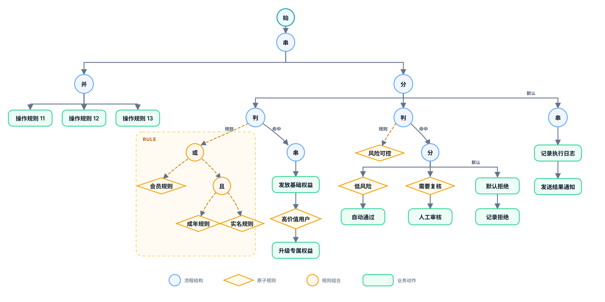

# UI 树与 Web 规则编辑器

> 适用模块：`mosika-ui`、`mosika-web`
>
> 更新时间：2026-08-04

## 1. 职责边界

`mosika-ui` 只提供可序列化、可递归遍历的 UI AST，以及 UI AST 到内核 `RuleNode` 的单向编译。它不包含页面、布局或 Web 依赖。

`mosika-web` 负责规则管理页面、REST、SQLite 持久化和 UI AST 的编辑交互。正式页面位于 `mosika-web/src/main/resources/static/ui/`。

UI 树及其 JSON 是编辑和持久化的事实来源。执行树只保留运行语义，不能从 `RuleNode` 或 DSL 反向猜测恢复 UI 布局和元数据。

## 2. 两个递归域

UI AST 是以 `Flow` 为宿主、以 `Rule` 为嵌入式子语言的多分类 AST：

```text
Flow = A(next?)
     | S(Flow+)
     | P(Flow+)
     | C(rule, Flow?)
     | J(Rule, Flow?)
     | D((C | J)+, Flow?)

Rule = R
     | And(Rule, Rule+)
     | Or(Rule, Rule+)
     | Hits(bounds, Rule+)
```

两个域单向连接：`Flow` 通过 `JNode.rule` 嵌入纯规则树，`Rule` 不能反向引用流程节点。`JNode` 左侧始终是规则求值，右侧 `action` 才是命中后执行的流程。

<p align="center">
  
</p>

## 3. 节点契约

| JSON 类型 | Java 节点 | 递归边 | 约束与语义 |
| --- | --- | --- | --- |
| `T` | `TreeNode` | `next` | 序列化根；`next` 是整棵流程的唯一入口 |
| `A` | `ANode` | `next` | 动作规则引用；执行完成后进入零个或一个后继 |
| `S` | `SNode` | `branches` | 一个或多个流程子树，严格按顺序执行 |
| `P` | `PNode` | `branches` | 一个或多个流程子树，并发执行并等待全部完成 |
| `C` | `CNode` | `action` | 兼容的原子条件节点；命中后执行可选流程 |
| `J` | `JNode` | `rule`、`action` | `rule` 必须是纯规则树；`action` 是可选命中流程 |
| `D` | `DNode` | `branches`、`action` | 有序检查 `CNode/JNode`，命中首个后停止；`action` 是可选默认流程 |
| `R` | `RNode` | 无 | 原子规则引用，只产生匹配结果 |
| `L` | `LNode` | `rules` | 与/或组合，至少两个纯规则子节点 |
| `H` | `HNode` | `rules` | `hits` 组合，至少一个纯规则子节点，边界必须合法 |

`DNode` 至少包含两个结果，即条件分支数量加可选默认分支数量不小于二。条件分支的 `action` 可以为空：命中该分支时表示已经完成选择并停止检查后续分支，但不执行额外动作。

树在任何递归校验、编译和序列化之前都要执行规模预检：最大深度 128，节点总数 2000，并拒绝重复对象引用和循环引用。这是编辑器与服务端共同执行的安全预算，不是 DSL 业务语义。

## 4. 单向编译

```text
UI TreeNode JSON
      │ deserialize / validateSize / validate
      ▼
   TreeNode
      │ UINodeAdapter.toRule()
      ▼
   RuleNode
      │ expr / RuleDefinition(useType=2)
      ▼
   RuleSuite
```

`UINodeAdapter` 只保留执行语义：

- `label`、`name`、选择状态和折叠状态不进入执行树；
- `RNode.expr` 保存稳定的 `RuleDefinition.ruleId` 引用，不复制后台 JavaScript 表达式；
- `SNode/PNode` 编译时使用 `∅` 稳定显式结构；
- `DNode` 编译为按顺序嵌套的 `CaseNode`；
- 另一条编排直接以带产品类型前缀的规则 ID（参考 Web 为 `f<id>`）保存在普通 `ANode.expr` 中；UI 与 Core 都不保留独立调用节点类型或特殊调用语法。
- 不提供从执行树返回 UI AST 的逆向转换。

修改节点模型时必须同步检查 `UINodeAdapter.toRule()`、`TreeNode.visit()`、`NodeTypeResolver`，以及“UI → JSON → UI → Rule”的结构和执行语义。

## 5. 主画布投影

- 主画布只展开从上到下的 `Flow` 递归，显示根、串行、并行、分支、条件和动作六类用户可理解的节点。
- `SNode`、`PNode`、`DNode` 分别投影为圆形的“串、并、分”。“分”表示有序互斥决策，不是普通无条件分叉。
- `JNode` 与它的规则子树在主画布合并为一个条件节点。规则树不占用主画布空间，命中流程仍在该节点下方原位展开。
- `CNode` 继续支持已有 JSON 的反序列化、显示和保存；新建业务条件统一使用 `JNode`。
- 布局、折叠、缩放和连线方向只服务阅读，不参与判断节点类型、执行顺序或作用域。

主画布单击选中节点。普通属性在右侧“节点属性”面板直接编辑；新增操作只作用于当前节点真实持有的 `next`、`action`、`branches` 或默认分支，页面不制造“同级节点”等模型中不存在的关系。

## 6. 规则弹窗

双击条件节点或点击属性栏“查看规则”打开统一规则弹窗：

- 左侧把纯 `Rule` 子树从左到右展开，同级规则纵向排列；
- 右侧是常驻编辑面板，没有查看/编辑模式切换，也不使用右键菜单；
- 一条规则引用生成 `RNode`，两条及以上引用才选择“与/或”并生成 `LNode`；
- 单规则转复合时，原 `RNode` 的名称、规则 ID 和取反状态完整保留为第一个子规则；
- 已有 `HNode` 可以显示和保存，当前与/或转换入口不创建新的 `hits`；
- 规则节点可以设置名称和取反，逻辑节点可以切换与/或、添加子规则并调整直接子规则顺序。

弹窗打开时保存规则子树快照。面板修改会实时更新预览，但只有“保存”才提交；“取消”或 Esc 恢复快照。外层 `JNode`、它的 `action` 和主流程位置不能因编辑规则子树而被替换或丢失。

## 7. 名称与引用

- 流程节点的可选展示名称使用 `label`；规则名称使用规则根节点的 `name`，两者不参与求值。
- `JNode` 的名称不存放在外层节点，而来自 `JNode.rule` 指向的实际规则根。
- 原子规则未命名时回退显示所引用的后台规则描述；复合规则未命名时显示“复合规则”，不回退展示表达式。
- 动作节点只能引用动作类型规则；条件和纯规则节点只能引用条件类型规则。新引用必须来自后端当前可用的 `RuleDefinition`。

## 8. 排序与画布操作

- 主画布和规则弹窗只允许同一父节点、同一有序分组中的兄弟重排，不跨父节点移动。
- 排序改变列表顺序，不改变父节点、分支数量或节点类型。
- 画布支持节点折叠、拖拽平移、滚轮平移、`Ctrl/Command + 滚轮` 缩放和“适应画布”。
- `JNode.action` 属于主流程递归，不能放进规则弹窗中导航，否则嵌套判断会退化成层层弹窗。

## 9. 保存与生效

编辑器维护一份 UI 树：

- “保存草稿”对 JSON 做反序列化和规模校验后保存，不要求当前结构已经可执行；
- “生效”执行规模校验、结构校验、单向编译和规则引用类型校验，通过后才发布新的 `RuleSuite`；
- 修改已生效流程并保存草稿，会把该流程恢复为草稿状态；
- 本地未保存修改只表示编辑器脏状态，不等同于后端草稿状态；
- 导入或保存失败时整体拒绝，不部分替换当前树。

编辑期内部 ID、选中和折叠状态不持久化。后端存储的是规范化 `TreeNode` JSON，并从中收集动作引用与条件引用。

## 10. 页面入口

- `/`：规则流列表
- `/rules`：原子规则库
- `/udfs`：JavaScript UDF 注册中心，支持列表、编译校验、版本修改、启停和运行态热刷新
- `/flow/{id}`：指定规则流编辑器
- `/ui/index.html`：编辑器静态页面

页面源码：

- [`console.html`](../mosika-web/src/main/resources/static/ui/console.html)
- [`rules.html`](../mosika-web/src/main/resources/static/ui/rules.html)
- [`udfs.html`](../mosika-web/src/main/resources/static/ui/udfs.html)
- [`index.html`](../mosika-web/src/main/resources/static/ui/index.html)
- [`app.js`](../mosika-web/src/main/resources/static/ui/app.js)
- [`treenode.js`](../mosika-web/src/main/resources/static/ui/treenode.js)
