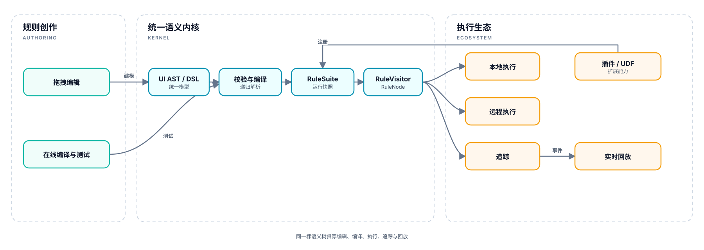
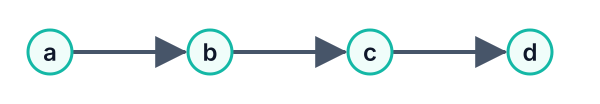
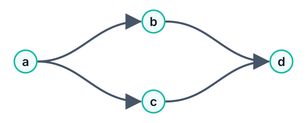
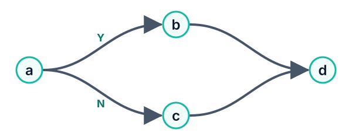
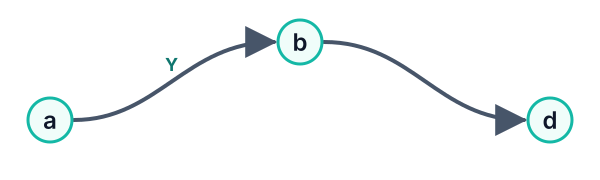
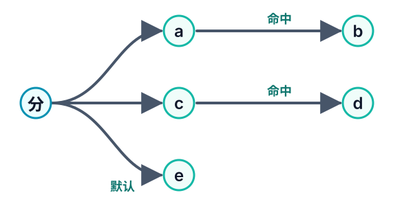
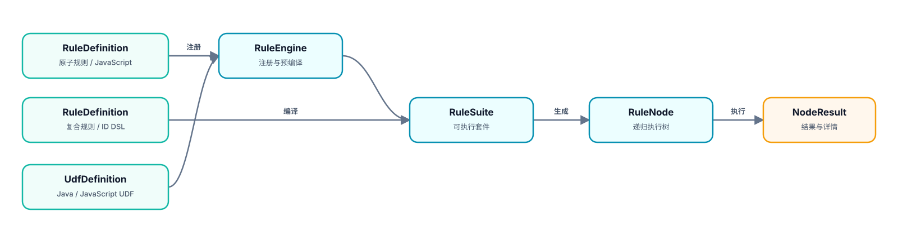

# Mosika

<p align="center">
  <strong>让规则图成为可编译、可执行、可追踪、可回放的业务语言</strong><br>
  <sub><strong>模型驱动的可视化规则流语言与执行内核</strong></sub><br>
  <sub>源自大规模企业级规则平台实践 · JDK 21 · GraalJS · ANTLR4</sub>
</p>

<p align="center">
  <a href="#为什么是-mosika">技术价值</a> ·
  <a href="#规则流是什么样的">核心能力</a> ·
  <a href="#模板参数化规则">模板参数</a> ·
  <a href="./docs/规则编辑器.md">参考 Web UI</a> ·
  <a href="./docs/核心设计.md">内核设计</a> ·
  <a href="./docs/技术演进规划-v2.md">技术演进</a> ·
  <a href="./docs/README.md">完整文档</a> ·
  <a href="./mosika-web/src/main/resources/static/ui/index.html">参考 UI 源码</a>
</p>

## 为什么是 Mosika

> **真正稀缺的不是“能拖拽”，而是从画布到运行时始终只有一套语义。**

Mosika 定义了一门以可视化 AST 为源代码的规则流语言：用户编辑的结构就是持久化模型，也是编译、执行、追踪和回放的唯一事实来源。它不是给编程框架补一层画布，也不是把另一套复杂 DSL 包装成流程图；**图就是语法，树形作用域就是语义，产品编排在 Core 边界统一编译为命名规则。**

这套内核已经在大规模企业级规则产品实践中衍生出可拖拽编辑、在线编译与测试、动态插件热插拔、实时回放、本地执行和远程执行。不同产品能力共享同一结构契约，无需在编辑器、服务端和执行器之间重复解释流程含义。

企业平台实现及其架构适配不属于本仓库。本项目保留与平台解耦的 Core、可序列化 UI AST 和参考 Web 服务，让同一语义内核能够被独立嵌入、扩展和验证。

### 核心与参考实现的边界

> **`mosika-web` 只是 UI 与控制面的参考实现，不是 Mosika 的核心。**

Mosika 的规则语义和执行能力全部来自 `mosika-core`；`mosika-ui` 只提供可序列化的 UI AST 及其到执行树的单向编译能力，也不包含真正的页面。可选的 `mosika-web` 使用 Spring Boot、SQLite 和静态页面演示如何把两者组合成一套可运行的规则管理与可视化编排界面，主要用于能力展示、集成验证和独立体验。

接入 Mosika 内核不需要依赖 `mosika-web`。参考 Web 不定义新的规则语义，不替代 Core/UI 的库制品，也不代表公司内部生产级产品的完整控制面、平台集成和生态能力。

### 设计初衷：让稳定语义沉淀，让业务策略自由组合

> **原子规则沉淀业务事实，规则流表达产品策略。**

Mosika 从一开始就把**规则的生成**与**规则的编排**作为两个独立生命周期：规则生产侧负责把领域知识封装为具有稳定业务语义、可以独立测试和复用的最小单元 `RuleDefinition`；产品与业务侧基于这些原子规则的稳定标识组织规则流，表达串行、并行、判断和决策，而不需要感知底层表达式或实现细节。

```text
规则生产：领域知识 ──> RuleDefinition(ruleId, expression, desc)
                              │
                              │ 稳定 ruleId 引用
                              ▼
产品编排：业务策略 ──> 命名规则流(串行 / 并行 / 判断 / 决策)
```

这条边界让规则实现可以独立演进，让同一业务语义可以被多个产品复用，也让产品策略能够以编排方式快速变化。技术团队沉淀可靠的规则能力，产品和业务专注表达“在什么场景下，按什么顺序，做什么决策”。

### 一次建模，全链路一致

<p align="center">
  
</p>

### 八个核心主张

| 核心主张 | Mosika 的回答 |
| --- | --- |
| **生成与编排解耦** | 原子规则是具有稳定业务语义的最小单元；规则流只引用稳定 `ruleId`，让规则实现与产品策略分别演进 |
| **一条规则，多组参数** | 原子规则可以声明 `$args` 模板参数，同一个 `ruleId` 在一棵规则树中按节点绑定不同 JSON 参数，无需为阈值差异复制规则定义 |
| **图即源代码** | UI AST 及其 JSON 是编辑和持久化的唯一事实来源，不从执行树反推模型，也不存在与画布分离的第二套流程语义 |
| **规则与流程分域** | `Rule` 只负责求值，`Flow` 负责执行；`FlowNode.rule` 单向嵌入规则子树，从类型上阻止规则反向携带流程关系 |
| **作用域显式可组合** | 串行、并行、判断和决策都是可递归嵌套的结构节点，不依赖坐标、连线方向、隐式汇合或通用 DAG 推断 |
| **先编译，后发布** | 定义先经过规模校验、结构校验和完整编译，再原子发布不可变 `RuleSuite` 快照，不向运行流量暴露半成品 |
| **结果语义不污染** | `matched`、业务 `result` 和执行详情各司其职，为在线测试、诊断、追踪和回放提供稳定契约 |
| **一核多端** | JavaScript 与 Java/JS UDF 提供插件扩展，同一规则流可以由本地、远程或混合执行后端承载 |

### 它不是普通规则框架的“可视化版”

- 组件编排从代码组件和共享上下文出发；Mosika 从可持久化、可编译的业务规则模型出发。
- 推理引擎从事实匹配、规则激活和冲突消解出发；Mosika 从确定性的树形作用域和执行顺序出发。
- 通用流程画布从节点、边和拓扑关系出发；Mosika 的 Flow 子树天然定义分支、顺序和局部汇合，不需要多入边或隐藏图算法。

Mosika 不试图替代 BPM、通用 DAG 或企业平台基础设施。它专注做好一件事：**让一份规则流语义在创作、持久化、编译、测试、执行、追踪和回放之间始终一致。**

## 规则流是什么样的

<table>
  <tr>
    <td width="50%" align="center">
      <strong>串行</strong><br>
      <code>a-&gt;b-&gt;c-&gt;d</code><br><br>
      
    </td>
    <td width="50%" align="center">
      <strong>并行</strong><br>
      <code>a-&gt;(b=&gt;c)-&gt;d</code><br><br>
      
    </td>
  </tr>
  <tr>
    <td width="50%" align="center">
      <strong>完整条件</strong><br>
      <code>(a?b:c)-&gt;d</code><br><br>
      
    </td>
    <td width="50%" align="center">
      <strong>半条件</strong><br>
      <code>a?(b-&gt;d)</code><br><br>
      
    </td>
  </tr>
  <tr>
    <td colspan="2" align="center">
      <strong>有序多分支</strong><br>
      <code>a?b:(c?d:e)</code><br><br>
      
    </td>
  </tr>
</table>

串行、并行、条件和决策都是显式结构节点，可以递归嵌套；布局方向只负责展示，不参与执行语义。

## 模板参数化规则

> **一条原子规则定义可以作为模板，在同一规则树中绑定不同参数重复使用。**

过去只有阈值不同的判断需要复制成多条规则：

```text
r1 = $.input > 100
r2 = $.input > 200
r3 = $.input > 300
```

现在可以只定义一条模板规则：

```text
threshold = $.input > $args.limit
```

在规则 ID DSL 的原子规则节点上绑定 JSON 参数：

```text
threshold("""{"limit":100}""") || threshold("""{"limit":300}""")
```

执行环境保持三个稳定入口：

| 名称 | 含义 |
| --- | --- |
| `$` | 本次执行的业务输入 |
| `$$` | 本次执行共享的可变上下文 |
| `$args` | 当前原子规则节点绑定的模板参数 |

ANTLR4 只负责识别三引号参数块的安全边界，`ExprNode` 在构造时通过 `JsonUtils` 把参数解析为 `Map<String,Object>`，并用规范化 JSON 生成稳定的 `expr()`；JavaScript 源码不做字符串替换。`NodeBuilder` 不缓存原子节点或参数变体，单次顶层执行由 `RuleVisitor` 直接按 `ExprNode.expr()` 复用叶子结果：对象字段在所有嵌套层级递归排序，数组元素顺序保留。相同参数组合只真正求值一次，不同参数组合分别求值；每次出现仍保留各自的执行节点、结果和动态描述。未传参数的规则保持原有语义，并收到空的 `$args` 对象。

完整语法、执行缓存和当前边界见[模板参数化规则](./docs/模板参数化规则.md)。

## 完整 UI 树

<p align="center">
  
</p>

<p align="center"><sub>Flow 是主递归域，Rule 通过判断节点嵌入；规则子树与命中流程保持明确边界。</sub></p>

## 从定义到执行

<p align="center">
  
</p>

- `RuleDefinition.ruleType=0` 描述 JavaScript 原子规则，`ruleType=2` 描述规则 ID DSL 复合规则。
- `RuleSuite` 只装配规则和 Java/JS UDF；产品层规则流在边界处编译为复合规则。
- `RuleEngine` 注册全部规则并预编译原子 JavaScript，是规则注册状态的唯一事实来源；`NodeGenerator` 只接收复合规则表，不维护第二份规则 ID 集合。
- 裸 `ruleId` 在命中复合规则定义时递归编译为 `CompositeNode`，保留完整执行详情并统一检测循环引用；复合规则只按唯一 `ruleId` 识别和复用，不存在 `f1("""...""")` 形式的参数化复合规则变体，参数只属于其内部原子规则调用。
- 规则 ID DSL 使用 `&&`、`||` 表达有序短路；`AllNode` 继承 `AndNode`，`AnyNode` 继承 `OrNode`，使 `all(...)`、`any(...)` 复用当前求值实现并保留独立语法身份；`some(min,max,...)` 表达命中数量约束。
- `matched` 表达匹配或控制状态，`result` 只传递节点具有明确语义的业务返回值。
- 原子规则可以使用 `$args` 声明模板参数，并通过 `ruleId("""{...}""")` 在 DSL 节点上绑定 JSON 对象；不同参数组合独立求值，结构相同的参数复用结果。

## 模块边界

| 模块 | 职责 | 不负责 |
| --- | --- | --- |
| `mosika-core` | DSL、规则树、执行上下文、求值、UDF、命名原子/复合规则 | 页面、持久化、Flow 产品模型与业务场景映射 |
| `mosika-ui` | 可序列化 UI AST，单向编译为 `RuleNode` | 页面布局、Web 依赖、从执行树反推 UI |
| `mosika-web` | 可选的 UI/控制面参考实现：REST、SQLite、规则管理和可视化编辑页面 | 规则语义、执行内核、替代 Core/UI 库制品、代表完整生产级平台 |

## 技术演进

后续演进坚持“语义契约优先、平台能力外置、兼容性可验证”：

1. 建立 DSL、UI JSON、执行结果和异常语义的兼容性测试套件，并为公开 API 建立版本基线。
2. 将全局运行快照、并行执行器、超时和取消策略改造成可注入的运行时能力，支持多套件隔离。
3. 提炼规则来源、插件解析、执行后端、追踪与回放等中立 SPI，使企业平台和独立实现复用同一内核。
4. 建立本地/远程执行一致性、插件生命周期、并发压力和性能回归基线。
5. 在保持语义稳定的前提下拆分模型、解析、运行时和 GraalJS 适配，降低按需接入成本。

完整阶段、交付物、验收标准和非目标见[技术演进规划 v2](./docs/技术演进规划-v2.md)。

## 运行

要求 JDK 21。

```bash
mvn clean test
```

启动管理界面：

```bash
./scripts/mosika.sh start
```

访问：

- 产品首页：<http://127.0.0.1:8080/>
- 命名空间：<http://127.0.0.1:8080/namespaces>
- 业务场景：<http://127.0.0.1:8080/scenes>
- 原子规则库：<http://127.0.0.1:8080/rules>
- JavaScript UDF 注册中心：<http://127.0.0.1:8080/udfs>
- 规则流画布：`http://127.0.0.1:8080/flow/{id}`

在 UDF 页面中可以注册带参数的 JavaScript 函数，例如把 `function bindCitations(target) { ... }` 注册为 `content.generation.bindCitations`，随后在普通规则表达式中直接调用 `content.generation.bindCitations($)`。创建、编辑和启用会经过内核编译校验，成功提交后热刷新当前 `RuleSuite`；`sys` 命名空间为内置能力保留。该页面只管理 JavaScript UDF，Java UDF 和远程插件仍通过 Core 的代码/SPI 边界接入。

UDF 是进程内可执行代码，不是面向不受信任用户的普通配置。参考 Web 默认只监听本机且不提供生产级鉴权；对外或多租户部署时，必须在平台层增加身份认证、分级授权、审核发布和操作审计。

仓库同时提供一套可重复导入的[内容生成领域演示数据](./mosika-web/src/main/resources/demo/README.md)：用 3 个领域 UDF、64 条原子规则和 7 条相互复用的规则流模拟素材证据链、内容路由、深度文章/快讯/营销文案生产、多渠道适配和分级发布门禁。它用于展示 Mosika 内核如何承载真实领域编排，不改变 `mosika-web` 仅作为参考 UI 与控制面的定位。

开发与运维命令：

```bash
./scripts/mosika.sh dev
./scripts/mosika.sh status
./scripts/mosika.sh logs
./scripts/mosika.sh restart
./scripts/mosika.sh stop
```

环境变量、运行目录和分模块验证命令见[开发与运行](./docs/开发与运行.md)。

## 进一步阅读

- [文档索引](./docs/README.md)：全部有效文档及其适用边界。
- [Core 核心设计](./docs/核心设计.md)：内核设计、运行链路与核心不变量。
- [模板参数化规则](./docs/模板参数化规则.md)：参数语法、`$args` 绑定、缓存语义、执行详情和使用边界。
- [UI 树与 Web 编辑器](./docs/规则编辑器.md)：UI AST、画布投影、编辑与持久化契约。
- [技术演进规划 v2](./docs/技术演进规划-v2.md)：内核契约、运行时解耦、SPI、回放和模块化路线。
- [开发与运行](./docs/开发与运行.md)：构建、测试、服务脚本和运行配置。
