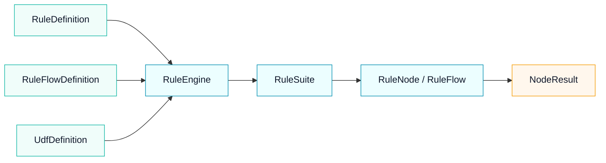

# Mousika

<p align="center">
  <strong>用递归 AST 表达规则、规则流与可视化编排</strong><br>
  <sub>JDK 21 · Maven · GraalJS · ANTLR4 · Spring Boot</sub>
</p>

<p align="center">
  <a href="#规则流是什么样的">核心能力</a> ·
  <a href="./docs/规则编辑器.md">Web 编辑器</a> ·
  <a href="./docs/核心设计.md">内核设计</a> ·
  <a href="./docs/README.md">完整文档</a> ·
  <a href="./mousika-web/src/main/resources/static/ui/index.html">Web UI 源码</a>
</p>

## 规则流是什么样的

<table>
  <tr>
    <td width="50%" align="center">
      <strong>串行</strong><br>
      <code>a-&gt;b-&gt;c-&gt;d</code><br><br>
      
    </td>
    <td width="50%" align="center">
      <strong>并行</strong><br>
      <code>a-&gt;(b=&gt;c)-&gt;d</code><br><br>
      
    </td>
  </tr>
  <tr>
    <td width="50%" align="center">
      <strong>完整条件</strong><br>
      <code>(a?b:c)-&gt;d</code><br><br>
      
    </td>
    <td width="50%" align="center">
      <strong>半条件</strong><br>
      <code>a?(b-&gt;d)</code><br><br>
      
    </td>
  </tr>
  <tr>
    <td colspan="2" align="center">
      <strong>有序多分支</strong><br>
      <code>a?b:(c?d:e)</code><br><br>
      
    </td>
  </tr>
</table>

串行、并行、条件和决策都是显式结构节点，可以递归嵌套；布局方向只负责展示，不参与执行语义。

## 完整 UI 树

<p align="center">
  
</p>

<p align="center"><sub>Flow 是主递归域，Rule 通过判断节点嵌入；规则子树与命中流程保持明确边界。</sub></p>

## 从定义到执行



- `RuleDefinition` 描述可执行规则；`RuleFlowDefinition` 描述命名规则流。
- `RuleSuite` 统一装配规则、Java/JS UDF 和规则流。
- `sys.flow.eval(flowId, target, context)` 支持规则流之间的内核级调用。
- `matched` 表达匹配或控制状态，`result` 只传递节点具有明确语义的业务返回值。

## 模块边界

| 模块 | 职责 | 不负责 |
| --- | --- | --- |
| `mousika-core` | DSL、规则树、执行上下文、求值、UDF、RuleFlow | 页面、持久化、业务场景映射 |
| `mousika-ui` | 可序列化 UI AST，单向编译为 `RuleNode` | 页面布局、Web 依赖、从执行树反推 UI |
| `mousika-web` | REST、SQLite、规则管理和可视化编辑页面 | 替代 core/ui 的库制品 |

## 运行

要求 JDK 21。

```bash
mvn clean test
```

启动管理界面：

```bash
./scripts/mousika.sh start
```

访问：

- 规则流列表：<http://127.0.0.1:8080/>
- 原子规则库：<http://127.0.0.1:8080/rules>
- 规则流画布：`http://127.0.0.1:8080/flow/{id}`

开发与运维命令：

```bash
./scripts/mousika.sh dev
./scripts/mousika.sh status
./scripts/mousika.sh logs
./scripts/mousika.sh restart
./scripts/mousika.sh stop
```

环境变量、运行目录和分模块验证命令见[开发与运行](./docs/开发与运行.md)。

## 进一步阅读

- [文档索引](./docs/README.md)：全部有效文档及其适用边界。
- [Core 核心设计](./docs/核心设计.md)：内核设计、运行链路与核心不变量。
- [UI 树与 Web 编辑器](./docs/规则编辑器.md)：UI AST、画布投影、编辑与持久化契约。
- [开发与运行](./docs/开发与运行.md)：构建、测试、服务脚本和运行配置。
